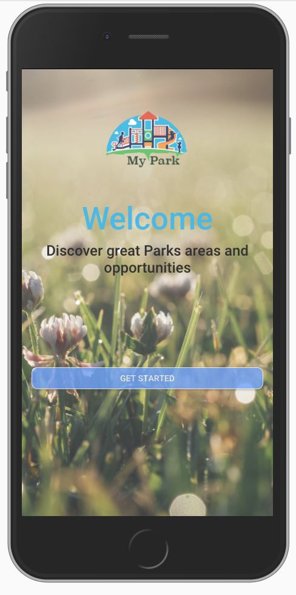
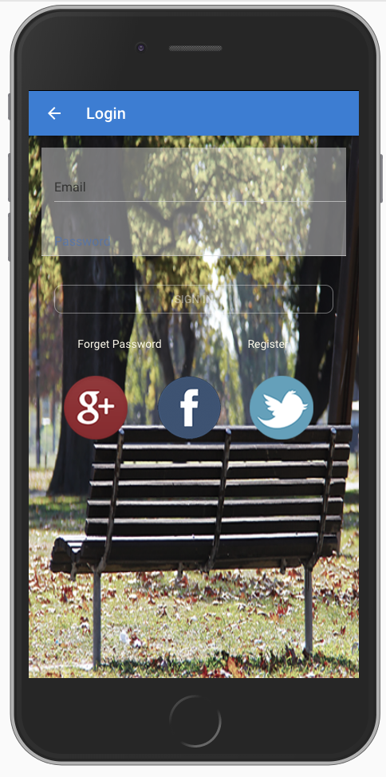
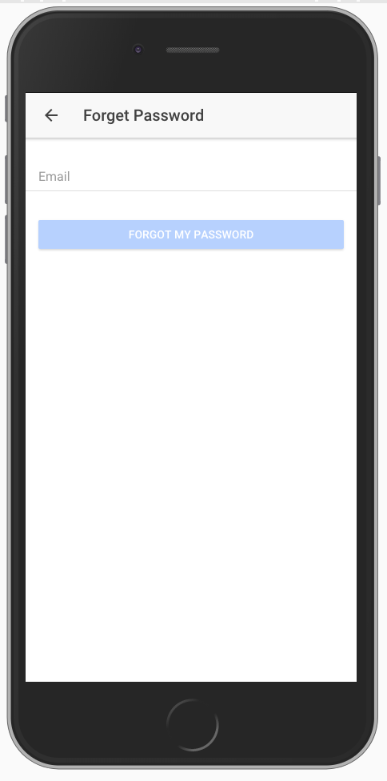
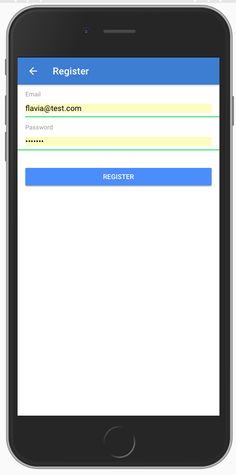
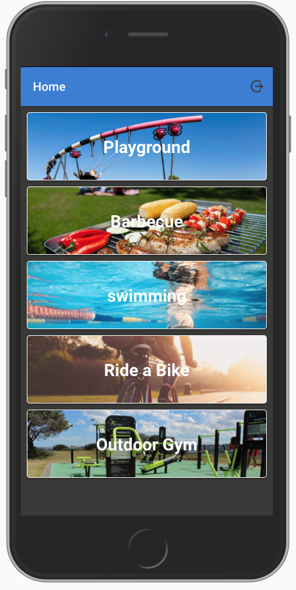

# Ionic MyPark Application

This is the official MyPark demo app, showcasing a variety of Ionic Framework components and native features.

## Table of Contents

* [Welcome Page]
* [Login Page]
* [Register Page]
* [Forgot Password Page]
* [HomePage ]

## Getting Started

* [Download the installer](https://nodejs.org/) for Node.js 6 or greater.
* Install the ionic CLI globally: `npm install -g ionic`
* Clone this repository: `git clone https://github.com/myparksydney/MyParkApp`.
* Run `npm install` from the project root.
* Run `ionic serve` in a terminal from the project root.

_Note: You may need to add “sudo” in front of any global commands to install the utilities._

## Screen shot

## Deploying

* PWA - Un-comment [this](https://github.com/myparksydney/MyParkApp), run `npm run ionic:build --prod` and then push the `www` folder to your favorite hosting service
* Android - Run `ionic cordova run android --prod`
  * If you are deploying to Android 4.4 or below we recommend adding crosswalk: `cordova plugin add cordova-plugin-crosswalk-webview`
* iOS - Run `ionic cordova run ios --prod`
